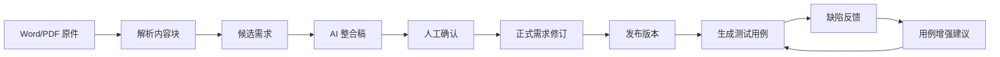
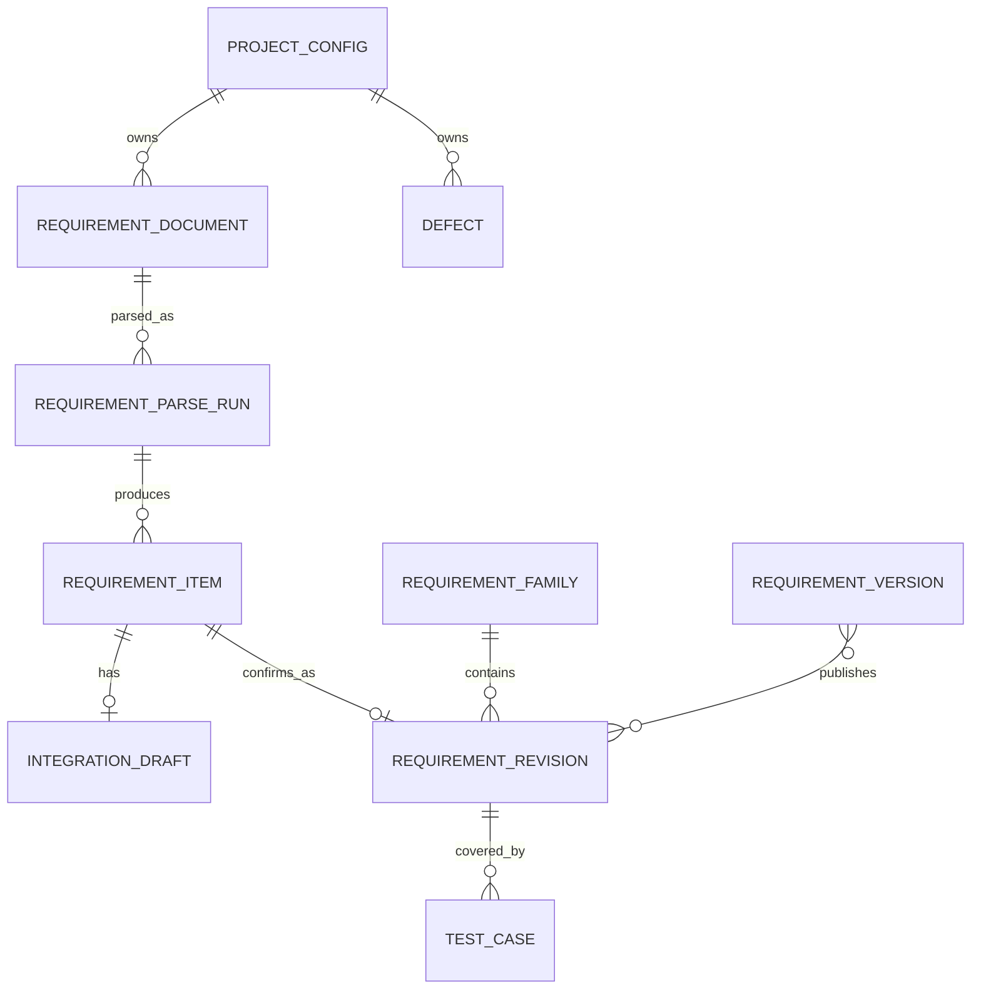
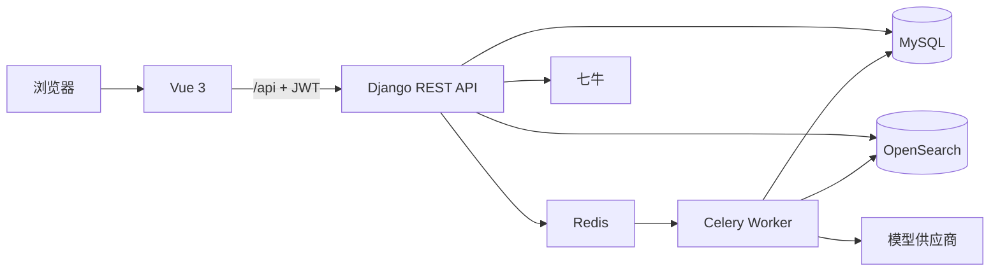
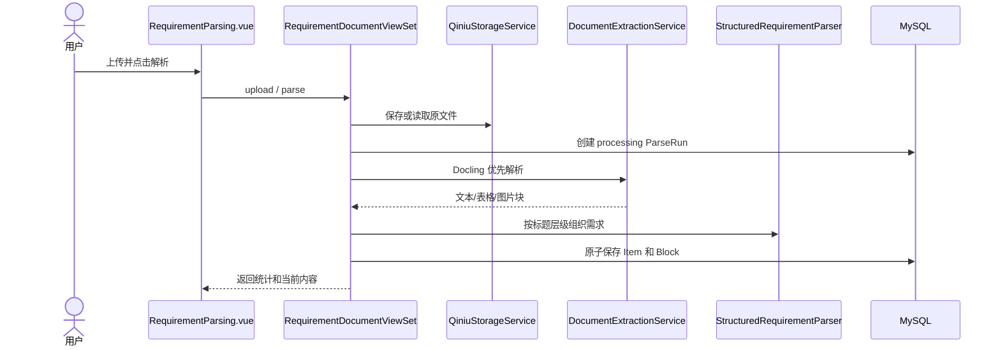
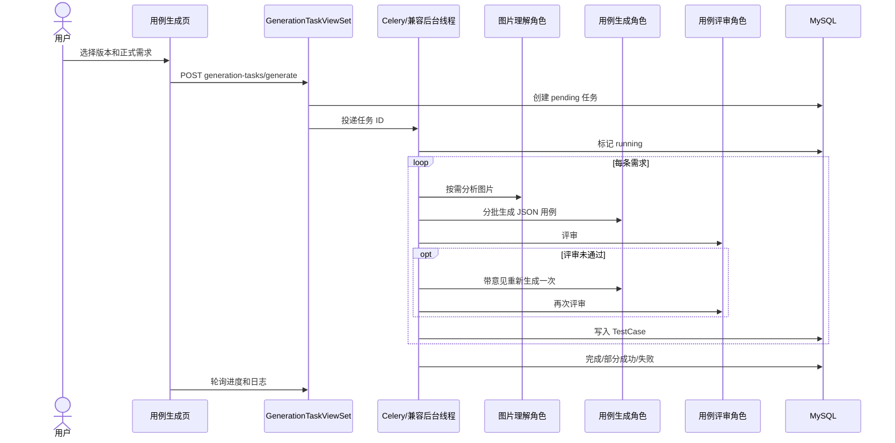
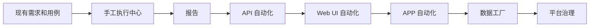

# TestHub Demo：从零读懂项目

> 面向第一次接触本项目的开发者。本文不要求你预先熟悉 Django、Vue、Celery 或 OpenSearch。

## 先说怎么读

这份文档分成两层：

- **第一部分到第七部分是新人主线**：按顺序读，目标是理解项目为什么这样设计，以及一次真实业务怎样从页面走到数据库。
- **附录是查阅手册**：接口、模型、排障和未来开发很多，不需要第一次就记住。

第一次阅读时，先记住三个结论：

1. 系统不会把 AI 生成的内容直接当成正式数据。
2. MySQL 保存业务真相；OpenSearch 只是可以重建的检索副本。
3. 最重要的主线是：原始文档 → 候选需求 → 人工确认的正式需求 → 发布版本 → 测试用例。

如果你要把项目讲给别人，建议使用 60 分钟路线：

| 时间 | 讲什么 | 讲完对方应该明白什么 |
| --- | --- | --- |
| 0–5 分钟 | 第一部分的具体故事 | 这是需求到用例的资产治理系统 |
| 5–15 分钟 | 六个核心名词 | 候选、整合稿、正式修订和版本的区别 |
| 15–30 分钟 | 最小 ER 图和四种存储 | MySQL 是真相，其他系统各有边界 |
| 30–40 分钟 | 后端分层与异步任务 | ViewSet、Service、Task 为什么分开 |
| 40–55 分钟 | 第五部分真实主链 | 从页面请求一直讲到数据落库和返回 |
| 55–60 分钟 | 当前边界和后续路线 | 哪些已完成，下一阶段为什么先做执行中心 |

现场不要从目录树开始讲，也不要逐个念接口。优先打开需求解析、整合审核、版本发布和生成任务日志，让听众把页面动作与第五部分对应起来。

## 目录

### 新人主线

1. [先看懂它在解决什么问题](#part-1)
2. [先认识六个核心名词](#part-2)
3. [从数据库关系理解整个项目](#part-3)
4. [理解后端为什么这样分层](#part-4)
5. [沿一条真实业务从入口走到结果](#part-5)
6. [前端只需要先理解这些](#part-6)
7. [如何在本地运行并继续学习](#part-7)

### 查阅附录

- [附录 A：模块、模型和状态速查](#appendix-a)
- [附录 B：API、任务和错误速查](#appendix-b)
- [附录 C：常见故障排查](#appendix-c)
- [附录 D：后续开发路线](#appendix-d)
- [附录 E：开发检查模板](#appendix-e)

---

<a id="part-1"></a>

# 第一部分：先看懂它在解决什么问题

## 1.1 一句话解释

TestHub Demo 是一个把“需求资料”逐步变成“可追踪测试用例”的后台管理系统。

它不是一个输入一句话就返回测试用例的聊天机器人，也不是已经完整实现了 API/UI/APP 自动化的测试平台。当前项目重点解决的是：

- 如何保留原始需求资料；
- 如何让 AI 帮助整理需求；
- 如何通过人工确认把候选内容变成正式需求；
- 如何基于正式需求生成测试用例；
- 如何用历史缺陷继续改进用例。

## 1.2 用一个具体故事理解

假设公司准备开发“用户登录”功能，产品经理上传了一份 Word 需求文档。

系统按下面的步骤工作：

1. 文档原件上传到七牛，MySQL 记录文件属于哪个项目。
2. Docling 解析标题、段落、表格和图片，拆出若干候选需求。
3. 候选需求只是“机器整理的工作稿”，还不是正式需求。
4. AI 从项目知识和历史正式需求中寻找相关证据，生成一份整合稿。
5. 人确认它属于哪些正式模块、和旧需求是什么关系、有没有冲突。
6. 审核通过后，系统创建一条不可变的正式需求修订。
7. 多条正式需求被绑定到一个需求版本，再由人发布。
8. 后台任务为版本中的正式需求生成并评审测试用例。
9. 以后出现的真实缺陷会进入缺陷库，为用例增强提供证据。



## 1.3 为什么中间要有这么多步骤

因为原始文档、AI 草稿和正式业务事实的可信度不同。

| 数据 | 谁产生 | 能否直接被下游使用 |
| --- | --- | --- |
| 原始文档 | 产品/需求人员 | 作为证据保留，不直接当结构化需求 |
| 解析候选 | 文档解析器 | 可以编辑，不能直接成为正式需求 |
| AI 整合稿 | 模型 | 可以修改、审核，不能自动发布 |
| 正式需求修订 | 人工确认流程 | 可以被版本、用例和缺陷引用 |
| 用例增强建议 | 模型 | 必须人工接受后才更新用例库 |

这就是项目最核心的设计原则：**AI 提供草稿和建议，人决定什么成为正式数据。**

## 1.4 当前已经实现什么

已经实现：

- JWT 登录和工作台；
- 项目、正式模块、模型和系统角色配置；
- 需求文档上传、结构化解析和图片理解；
- 项目知识、历史需求检索和需求整合；
- 人工关系确认、冲突处理、正式需求修订；
- 需求版本发布、测试用例生成和用例库；
- 缺陷导入、确认和缺陷驱动的用例增强；
- Celery 后台任务、OpenSearch 检索和统一错误协议。

尚未实现：统一测试执行、执行报告、API 自动化、Web UI 自动化、APP 自动化和数据工厂。首页上的这些卡片目前只是规划入口。

---

<a id="part-2"></a>

# 第二部分：先认识六个核心名词

新人最容易混淆的是下面六个对象。先理解它们，再看代码。

## 2.1 `ProjectConfig`：项目的唯一身份

它代表“这是哪个项目”。需求、版本、用例、缺陷和搜索任务都引用它。

虽然类名里有 Config，但它已经是全系统的项目主实体。后续开发不能再创建另一张重复的 `Project` 表。

## 2.2 `RequirementDocument`：原始需求资料

它记录上传文件的名称、类型、七牛 Key、所属项目和解析状态。

一个项目可以有很多文档；一份文档也可以被多次解析。原文件和解析历史都需要保留。

## 2.3 `RequirementItem`：解析出来的候选需求

它是从文档中拆出来的小需求，例如“连续输错五次密码后锁定账号”。

它可以修改、合并和归档，但它仍然属于来源层，不是最后的正式需求。

## 2.4 `RequirementIntegrationDraft`：可编辑的 AI 整合稿

它保存 AI 整理后的标题、描述、验收标准、模块建议、历史关系、冲突和开放问题。

它和 `RequirementItem` 一对一。模型生成后，人仍然可以修改。

## 2.5 `RequirementRevision`：正式需求快照

这是系统认可的正式需求。它创建后不再覆盖修改；以后发生变化时，创建下一条修订并链接上一条。

多个修订属于同一个 `RequirementFamily`。可以把 Family 理解为“同一个需求的稳定身份证”，Revision 理解为“这个需求在某次确认时的正式内容”。

## 2.6 `RequirementVersion`：一次发布集合

版本不是需求正文。它只是把若干正式需求修订组织成一次可发布的范围，例如 `v1.2`。

版本发布后，测试用例生成才有稳定的业务基线。

## 2.7 六个对象放在一起

```text
ProjectConfig
└── RequirementDocument                  原始资料
    └── RequirementParseRun              一次解析
        └── RequirementItem              候选需求
            └── RequirementIntegrationDraft  AI 整合工作稿
                └── RequirementRevision  人工确认后的正式需求
                    └── RequirementVersion  发布时被版本收录
```

严格来说，`RequirementVersion` 与 `RequirementRevision` 是多对多关系，图中只是为了表达阅读顺序。

---

<a id="part-3"></a>

# 第三部分：从数据库关系理解整个项目

## 3.1 先看最小关系图

第一次阅读只需要看下面这张图：



它表达了三条线：

- **来源线**：文档 → 解析批次 → 候选需求；
- **正式线**：候选需求 → 正式修订 → 发布版本；
- **测试反馈线**：正式修订 → 测试用例 → 缺陷 → 用例增强。

## 3.2 为什么解析批次不能省略

`RequirementParseRun` 表示一次解析尝试。

如果重新解析失败，上一批成功结果仍然可用；只有新批次全部保存成功，系统才原子切换 `is_current`。因此“重试解析”不会把当前需求清空。

解析结果进一步拆成 `RequirementContentBlock`：

- text：段落和标题；
- table：表格结构、HTML/Markdown；
- image：七牛图片 Key、地址和尺寸。

这些内容块保留原文顺序，是之后展示来源和生成上下文的基础。

## 3.3 为什么模块也要使用稳定 ID

`ProjectModule` 使用父子关系组成正式模块树。需求、需求族、正式修订和缺陷通过多对多关系引用模块 ID。

编辑模块时并不立刻修改正式值，而是生成 `ProjectModuleRevision` 候选。确认以后，稳定的模块 ID 不变，名称、父级和描述更新。这样模块改名后，下游关系不会断掉。

## 3.4 为什么正式需求不能直接 UPDATE

测试用例和缺陷需要知道“当时依据的是哪一版需求”。如果直接覆盖同一行，历史就无法解释。

因此：

```text
RequirementFamily LOGIN-LOCK
├── Revision 1：连续输错 5 次锁定 10 分钟
└── Revision 2：连续输错 5 次锁定 30 分钟
```

Revision 2 使用 `previous_revision` 指向 Revision 1。旧版本仍可引用 Revision 1，新版本可以引用 Revision 2。

## 3.5 任务为什么也要落数据库

用例生成、需求批量整合、用例增强和索引写入都可能耗时或失败。

任务表保存：

- pending/running/completed/partial_success/failed 状态；
- 进度、成功数、失败数；
- 阶段日志；
- 结构化错误 `error_info`；
- `retry_of`，用于关联人工重试的新任务。

Redis 只负责传递任务，不能代替这些历史记录。

## 3.6 四种存储各自负责什么

| 存储 | 保存什么 | 是不是业务真相 |
| --- | --- | --- |
| MySQL | 项目、需求、版本、用例、缺陷、任务和状态 | 是 |
| 七牛 | 需求原文件和解析图片 | 是外部文件来源，MySQL 保存引用 |
| OpenSearch | 正式知识、正式需求、有效用例和确认缺陷的检索副本 | 否，可以重建 |
| Redis | Celery 消息、结果和 Channels 临时消息 | 否 |

---

<a id="part-4"></a>

# 第四部分：理解后端为什么这样分层

## 4.1 系统全景



## 4.2 后端 app 怎么分

| app | 新人可以先理解为 |
| --- | --- |
| `apps.users` | 登录 |
| `apps.configuration` | 项目和 AI 配置 |
| `apps.project_knowledge` | 正式模块和项目规则 |
| `apps.requirements` | 从文档到用例增强的核心业务 |
| `apps.defects` | 缺陷知识库 |
| `apps.search` | OpenSearch 检索副本 |
| `apps.core` | 所有模块共用的错误协议 |

第一次阅读不需要把每个文件都看一遍。核心业务大部分集中在 `apps.requirements`。

## 4.3 一次请求怎么穿过后端

以“发布需求版本”为例：

```text
POST /api/requirements/versions/{id}/publish/
  → backend/urls.py
  → apps/requirements/urls.py
  → RequirementVersionViewSet.publish()
  → 校验版本状态和正式需求数量
  → 更新 RequirementVersion.status/published_by/published_at
  → Serializer 输出最新版本
  → 前端刷新列表
```

各层职责：

| 层 | 职责 |
| --- | --- |
| Model | 表、关系、约束和简单领域方法 |
| Serializer | 请求字段和关联范围校验，安全输出 |
| ViewSet | HTTP、权限、事务入口和流程编排 |
| Service | 跨模型规则、模型调用、外部服务适配 |
| Task | 长时间后台执行、进度和错误记录 |

## 4.4 为什么既有 CRUD，又有 action

普通资源增删改查使用 `ModelViewSet`。但是“确认、发布、归档、重试、生成”不是普通字段编辑，因此用明确的 action：

```text
POST .../{id}/confirm/
POST .../{id}/publish/
POST .../{id}/retry/
```

这样可以清楚表达允许状态、操作者、事务和副作用。

## 4.5 为什么长操作放到 Celery

需求批量整合、用例生成、用例增强、知识提取和索引重建都可能需要多次外部请求。如果在一个 HTTP 请求内完成，会遇到超时、断线和重复提交。

标准流程是：

```text
页面提交
→ Django 校验并创建 pending 任务记录
→ 投递任务 ID 到 Redis
→ Celery Worker 将任务改为 running
→ 分阶段更新日志和进度
→ 写入业务结果
→ completed / partial_success / failed
→ 页面轮询任务详情
```

当前代码有一处需要特别注意：用例生成、用例增强以及部分人工重试接口在 Celery 连接失败时，会启动 Django 进程内的 daemon 后台线程继续执行。它不是同步阻塞当前请求，但任务生命周期会脱离 Celery Worker。新人应把它理解为当前本地可用性兼容措施，不是理想的生产队列设计；知识提取、首次批量整合和搜索索引等入口仍直接依赖 Celery。

## 4.6 AI 配置为什么分“模型”和“角色”

`LLMModelConfig` 回答“怎么连接哪个模型”；`PromptConfig` 回答“这个模型在业务里扮演什么角色”。

```text
业务用途
→ 允许的协议
→ 允许的供应商
→ 系统角色
→ 角色明确绑定一个启用模型
→ 业务服务调用
```

例如用例生成必须解析启用的 `testcase_writer` 角色，评审必须解析 `testcase_reviewer`。角色缺失或绑定模型用途不匹配时直接失败，不使用默认模型降级。

当前角色包括：通用对话、需求整合、用例生成、用例增强、用例评审、图片理解、文本向量和自动化 Agent。

---

<a id="part-5"></a>

# 第五部分：沿一条真实业务从入口走到结果

这一部分最重要。不要先背目录，跟着用户操作往下追。

## 5.1 第一步：创建项目和正式模块

### 用户入口

```text
/configuration/projects
/configuration/projects/:id
```

页面：

- `frontend/src/views/configuration/ConfigurationProjects.vue`
- `frontend/src/views/configuration/ConfigurationProjectDetail.vue`

### 请求链

```text
页面
→ frontend/src/api/configuration.js
→ /api/configuration/projects/
→ ProjectConfigViewSet
→ ProjectConfig / ProjectConfigRevision
```

模块树继续走：

```text
frontend/src/api/projectKnowledge.js
→ /api/project-knowledge/modules/
→ ProjectModuleViewSet
→ ProjectModule / ProjectModuleRevision
```

### 数据结果

新建项目/模块会生成第一条确认修订。之后编辑只保存 candidate；点击确认后，事务才把候选内容写回稳定主记录，并把旧确认修订标记为 superseded。

## 5.2 第二步：上传并解析需求文档

### 用户入口

```text
/requirements/documents
/requirements/parsing
```

页面调用 `frontend/src/api/requirements.js`：

```text
uploadRequirementDocument()
parseRequirementDocument(id)
getRequirementDocumentContent(id)
```

### 后端链路



相关代码：

- View：`apps/requirements/views.py` 中的 `RequirementDocumentViewSet`；
- 存储/解析：`apps/requirements/services.py` 中的 `QiniuStorageService`、`DocumentExtractionService`、`StructuredRequirementParser`；
- 表：`RequirementDocument`、`RequirementParseRun`、`RequirementItem`、`RequirementContentBlock`。

### 失败时发生什么

新解析批次变成 failed，上一批 `is_current=True` 的结果继续有效。不会先清空旧需求再尝试解析。

## 5.3 第三步：AI 整合候选需求

用户可以单条整合，也可以对一份文档创建批量整合任务。

```text
POST /api/requirements/items/{id}/integrate/
POST /api/requirements/documents/{id}/integrate_batch/
```

核心实现是 `apps/requirements/integration.py` 中的 `RequirementReviewService`：

1. 读取候选需求和原始内容块；
2. 读取同一文档的其他候选作为上下文；
3. 从正式模块树构建允许的完整路径目录；
4. 分别检索项目知识和历史正式需求；
5. 解析启用的需求整合角色及其模型；
6. 要求模型返回结构化整合结果；
7. 保存整合稿、匹配候选、证据、冲突和开放问题。

模型返回的模块路径不会直接相信。后端只接受当前项目内、启用且完整路径精确匹配的模块；无法解析的路径进入 `unresolved_module_paths`。

## 5.4 第四步：人工确认并形成正式需求

人工操作顺序：

```text
确认历史关系和正式模块
→ 处理阻断冲突
→ 处理或记录开放问题
→ 审核整合稿
→ 正式确认
```

对应接口：

```text
POST .../items/{id}/confirm_relationship/
POST .../conflicts/{id}/resolve/
POST .../open-questions/{id}/handle/
POST .../items/{id}/review_integration/
POST .../items/{id}/confirm_formal/
```

`confirm_formal` 最终创建或复用 `RequirementFamily`，再创建不可变 `RequirementRevision`，同步多个正式模块，并创建 OpenSearch 索引任务。

这里是候选层进入正式层的唯一关键门禁。

## 5.5 第五步：绑定并发布需求版本

页面：`RequirementVersions.vue`。

```text
新建版本 draft
→ bind_requirements 绑定同项目正式需求修订
→ publish 发布
→ published 版本可以用于用例生成
→ archive 后不再用于新任务
```

待发布版本可以移除绑定；已发布版本只能追加，不能移除已有正式需求。

## 5.6 第六步：生成并评审测试用例

页面：`TestCaseGeneration.vue`。



关键代码：

- 创建任务：`TestCaseGenerationTaskViewSet.generate()`；
- 后台执行：`run_testcase_generation_task()`；
- 模型调用与解析：`TestCaseGenerationService`；
- 图片分析：`RequirementImageAnalysisService`；
- 结果：`TestCaseGenerationTask`、`TestCase`、`SearchIndexJob`。

单条需求失败不会阻断后续需求，所以整个任务可能是 partial_success。

## 5.7 第七步：缺陷反过来增强用例

缺陷新建或导入后先是 draft。人工确认后才写入 OpenSearch；作废后从检索中移除。

增强任务按正式需求检索：

- 历史有效用例；
- 已确认缺陷。

它先把命中结果保存为 `TestCaseEnhancementEvidence` 快照，再生成 add/update 建议。建议仍然需要人工 accept/reject。

更新旧用例时会比较 `before_hash`。如果用例已被其他人修改，建议进入 conflict，不会静默覆盖。

## 5.8 OpenSearch 在主线中的位置

OpenSearch 目前只索引四类正式资产：

- 已确认项目知识；
- 正式需求修订；
- 绑定正式需求的有效用例；
- 已确认缺陷。

搜索流程先按项目、资产类型、confirmed 状态、版本和模块过滤，再组合关键词与 768 维向量检索。父模块筛选会展开全部后代 ID。

业务确认只创建 `SearchIndexJob`；Celery 实际写入。索引失败不会回滚已确认的 MySQL 数据，服务恢复后可以 retry 或全量 reindex。

---

<a id="part-6"></a>

# 第六部分：前端只需要先理解这些

## 6.1 前端结构

```text
frontend/src/
├── views/       页面
├── api/         后端接口函数
├── stores/      跨页面状态，当前重点是登录用户
├── router/      页面路由和登录守卫
├── layout/      顶部、侧栏和内容区
├── utils/       Axios 和错误处理
└── components/  公共组件
```

## 6.2 一次页面请求

```text
Vue 页面
→ frontend/src/api/<domain>.js
→ frontend/src/utils/api.js
→ Vite 将 /api 代理到 Django
→ 后端响应
→ 页面更新表格、详情或任务状态
```

页面不能自行创建 Axios 实例，也不应该到处拼接口字符串。

## 6.3 登录

1. `Login.vue` 调用 Pinia `user` store；
2. `/api/auth/login/` 返回 access、refresh 和用户；
3. Store 保存到 localStorage；
4. Axios 拦截器添加 Bearer token；
5. 路由守卫调用 `/api/auth/me/`；
6. 401 时清理状态并跳回登录页。

## 6.4 页面地图

```text
/home
├── 配置中心
│   ├── 项目配置与详情
│   ├── 大模型配置
│   └── 系统角色配置
└── 需求用例中心
    ├── 需求文档
    ├── 需求解析
    ├── 详细需求
    ├── 版本管理
    ├── 用例生成
    ├── 用例增强
    ├── 用例库/详情
    └── 缺陷库
```

首页不显示侧栏；进入业务模块后只显示当前模块菜单。异步任务页面通过轮询展示进度，当前还没有前端 WebSocket 推送。

## 6.5 新人暂时不用深挖什么

第一次阅读不需要逐段研究 Element Plus 表格、CSS 和所有弹窗。先确认页面调用了哪个 `api/*.js` 函数，再去后端找对应 action；只有定位 UI 问题时再读组件细节。

---

<a id="part-7"></a>

# 第七部分：如何在本地运行并继续学习

## 7.1 需要的服务

- Python 3.12 和项目虚拟环境；
- MySQL 8；
- Redis；
- Docker 中的 OpenSearch；
- Node.js/npm；
- 做完整业务演示时还需要七牛和模型配置。

## 7.2 初始化

```bash
python3.12 -m venv .venv
source .venv/bin/activate
pip install -r requirements.txt
```

```sql
CREATE DATABASE test_hub_demo CHARACTER SET utf8mb4 COLLATE utf8mb4_unicode_ci;
```

```bash
.venv/bin/python manage.py check
.venv/bin/python manage.py migrate
.venv/bin/python manage.py createsuperuser
npm --prefix frontend install
```

从 `.env.example` 创建本地 `.env`，不要提交真实 Key。

## 7.3 启动顺序

先启动 MySQL 和 Redis，然后分别运行：

```bash
docker compose -f docker-compose.opensearch.yml up -d --build
.venv/bin/python manage.py runserver 8000
.venv/bin/celery -A backend worker -l info
npm --prefix frontend run dev -- --host 0.0.0.0
```

访问：

- 前端：`http://127.0.0.1:3000/login`
- Swagger：`http://127.0.0.1:8000/api/docs/`

项目没有 `/api/health/`。OpenSearch 健康接口是登录后的 `/api/search/index-jobs/health/`。

## 7.4 推荐的代码学习顺序

### 第一天：只理解地图

1. `README.md`
2. `backend/urls.py`
3. `frontend/src/router/index.js`
4. 本文第一至第三部分

目标：能说清主要模块和数据库主线。

### 第二天：追需求主链

1. `apps/requirements/models.py`
2. `apps/requirements/urls.py`
3. `RequirementDocumentViewSet`
4. `DocumentExtractionService`
5. `RequirementReviewService`

目标：能从文档入口追到正式需求修订。

### 第三天：追用例和异步任务

1. `TestCaseGenerationTaskViewSet.generate()`
2. `apps/requirements/tasks.py`
3. `TestCaseGenerationService`
4. `apps/search/services.py` 和 `opensearch.py`

目标：能解释为什么需要 Celery，以及生成结果如何进入用例库和索引。

### 第四天：最后看前端

从一个页面开始：Vue 文件 → API 函数 → 后端 action。不要按目录依次阅读所有 Vue 文件。

## 7.5 读完后的自测

如果你能回答下面五个问题，就已经理解主干：

1. 为什么 `RequirementItem` 不是正式需求？
2. 为什么 `RequirementRevision` 不直接 UPDATE？
3. `RequirementVersion` 和正式需求是什么关系？
4. 用例生成为什么要有数据库任务记录和 Celery？
5. OpenSearch 删除了以后，为什么业务数据仍然存在？

---

<a id="appendix-a"></a>

# 附录 A：模块、模型和状态速查

## A.1 app 与模型

| app | 主要模型 |
| --- | --- |
| configuration | `ProjectConfig`、`ProjectConfigRevision`、`LLMModelConfig`、`PromptConfig` |
| project_knowledge | `ProjectModule`、`ProjectModuleRevision`、`ProjectKnowledgeItem/Revision/Evidence` |
| requirements | 文档、解析、候选、整合、正式需求、版本、用例及各类任务 |
| defects | `Defect`、`DefectImportBatch` |
| search | `SearchIndexJob` |

## A.2 关键状态

| 对象 | 状态主线 |
| --- | --- |
| 项目/模块修订 | candidate → confirmed → superseded |
| 解析批次 | processing → completed/failed |
| 整合稿 | pending → completed/failed；另有关系确认和审核状态 |
| 需求版本 | draft → published → archived |
| 后台任务 | pending → running → completed/partial_success/failed |
| 增强建议 | pending → accepted/rejected/conflict |
| 缺陷知识 | draft → confirmed → invalid |
| 索引任务 | pending → running → success/failed |

## A.3 删除规则

- 来源内部从属数据多用 CASCADE；
- 正式修订、版本和审计用户多用 PROTECT；
- 能归档时优先归档，不随意物理删除；
- 七牛对象必须先远程删除成功，才能删除 MySQL 记录；
- OpenSearch 是副本，可以在业务数据保留的情况下重建。

---

<a id="appendix-b"></a>

# 附录 B：API、任务和错误速查

## B.1 API 前缀

| 前缀 | 领域 |
| --- | --- |
| `/api/auth/` | 登录和当前用户 |
| `/api/configuration/` | 项目、模型、系统角色 |
| `/api/project-knowledge/` | 正式模块和项目知识 |
| `/api/requirements/` | 文档、需求、版本、用例和增强 |
| `/api/defects/` | 缺陷和导入 |
| `/api/search/` | 索引健康、重建和重试 |

完整请求/响应以 `/api/docs/` 生成的 Swagger 为准。

## B.2 最重要的命令接口

```text
POST /api/configuration/projects/{id}/confirm/
POST /api/project-knowledge/modules/{id}/confirm/
POST /api/requirements/documents/{id}/parse/
POST /api/requirements/documents/{id}/integrate_batch/
POST /api/requirements/items/{id}/integrate/
POST /api/requirements/items/{id}/confirm_relationship/
POST /api/requirements/items/{id}/review_integration/
POST /api/requirements/items/{id}/confirm_formal/
POST /api/requirements/versions/{id}/publish/
POST /api/requirements/generation-tasks/generate/
POST /api/requirements/enhancement-tasks/generate/
POST /api/requirements/enhancement-suggestions/{id}/accept/
POST /api/defects/confirm/
POST /api/search/index-jobs/reindex/
```

## B.3 Celery 任务

| 任务 | 作用 |
| --- | --- |
| `run_requirement_integration_batch` | 批量整合候选需求 |
| `run_testcase_generation_task` | 生成、评审并保存用例 |
| `run_testcase_enhancement_task` | 检索历史证据并生成增强建议 |
| `run_knowledge_extraction` | 从可信材料提取项目知识候选 |
| `run_search_index_job` | 写入或删除一项检索资产 |
| `enqueue_project_reindex` | 为项目枚举全部有效索引资产 |

## B.4 分页和错误

列表统一返回：

```json
{"count": 0, "next": null, "previous": null, "results": []}
```

页大小默认 10，最大 100。筛选应在后端完成，不能请求大页后只在前端过滤。

错误统一返回：

```json
{
  "error": {
    "code": "QUEUE_UNAVAILABLE",
    "message": "后台任务队列不可用",
    "reason": "任务未能提交给 Celery 工作进程",
    "solution": "请确认 Redis 和 Celery 已启动后重新发起",
    "retryable": true,
    "trace_id": "ERR-..."
  },
  "detail": "后台任务队列不可用",
  "field_errors": {}
}
```

供应商正文、API Key、Authorization、password、secret 和 token 不返回前端，并在日志中脱敏。

---

<a id="appendix-c"></a>

# 附录 C：常见故障排查

## C.1 登录或跨域失败

同时检查 `CORS_ALLOWED_ORIGINS` 和 `CSRF_TRUSTED_ORIGINS`。二者不是同一个机制。JWT API 使用 Bearer token，401 会让前端清理登录状态。

## C.2 文档解析失败

检查七牛五个配置项，以及当前虚拟环境能否导入 `docx`、`PyPDF2`、`qiniu` 和 Docling。新解析失败不应影响旧 current 批次。

## C.3 任务一直 pending

```bash
.venv/bin/celery -A backend inspect ping --timeout=5
```

确认 Redis 可连接；Django 进程实际导入的 Celery app 是 `backend`；Django 和 Worker 使用同一 broker URL。用例生成/增强可能已经通过 daemon 线程执行，所以还要同时检查任务的 `started_at` 和 Django 进程日志；不要仅凭 Celery 中没有任务就重复提交。修复队列后再使用人工 retry。

## C.4 模型返回无法解析

先看任务阶段和 `error_info`。重点检查数据库中的角色 Prompt 是否要求 Markdown，而运行时解析器是否要求 JSON。Prompt 和解析契约必须一致。

## C.5 OpenSearch 不可用

检查容器、索引别名、Embedding 角色和 768 维配置。单节点 yellow 通常只是副本未分配。恢复后 retry 或 reindex，不要从 OpenSearch 反向修复 MySQL。

## C.6 前端 build 通过但页面仍有问题

构建只证明能编译。仍需实际验证登录、分页、窄窗口操作列、任务轮询和错误弹窗。

---

<a id="appendix-d"></a>

# 附录 D：后续开发路线

> 以下是规划，不是当前实现。每个阶段开始前都要单独完成需求、ER、状态机和接口评审。

## D.1 总原则

- 继续使用 `ProjectConfig`，不创建第二套项目主表；
- 执行开始时保存用例和环境快照；
- 自动化引擎统一回写执行中心，不各建一套报告；
- 长任务继续使用持久任务记录和 Celery；
- 新 AI 能力必须新增用途和角色，不硬编码模型；
- MySQL 继续作为权威数据源。

## D.2 第一阶段：项目协作和手工执行

目标：让现有用例真正可以执行。

建议模型：

```text
ProjectMember
ProjectEnvironment
TestPlan
TestPlanCase
TestRun
TestRunCase
TestStepResult
ExecutionArtifact
```

关键规则：计划纳入用例时保存快照；执行结果区分 passed、failed、blocked、skipped、cancelled；修改当前用例不能改变历史执行。

## D.3 第二阶段：报告

建议 `TestReport`、`ReportSection`、`QualityMetricSnapshot`。报告只从持久执行结果生成，发布后保存统计快照，可追溯到具体执行用例。

## D.4 第三阶段：API 自动化

建议 `ApiCollection`、`ApiEnvironment`、`ApiRequestCase`、`ApiAssertion`、`ApiExecution`。接口资产关联现有 `TestCase`，执行结果适配到统一 `TestRunCase`，密钥只返回掩码。

## D.5 第四阶段：Web UI 自动化

建议 `WebApplication`、`PageElement`、`UIFlow`、`UIFlowStep`、`UIExecution`。低代码确定性 Flow 与动态 AI Browser Agent 分开建模，但都接入统一执行结果。

## D.6 第五阶段：APP 自动化

建议 `MobileApplication`、`AppBuild`、`AppDevice`、`AppFlow`、`AppExecution`。设备必须互斥锁定；设备离线、安装失败、驱动失败和断言失败使用不同状态。APP Flow 执行器不等同于 AI Agent。

## D.7 第六阶段：数据工厂与平台治理

数据工厂建议 `DataTemplate`、`DataFieldRule`、`DataSource`、`DataGenerationTask`。之后再补 RBAC、审计、SSE/WebSocket、定时调度、任务监控、归档、备份和生产部署基线。



---

<a id="appendix-e"></a>

# 附录 E：开发检查模板

## E.1 新功能设计时必须回答

1. 要解决什么问题，明确不解决什么？
2. 上游数据和下游数据是什么？
3. ER 和状态机是什么？
4. 哪些数据可以改，哪些必须保存快照或修订？
5. API 是资源 CRUD 还是命令 action？
6. 哪些逻辑属于 Service，哪些需要 Celery？
7. 如何处理权限、密钥、幂等、并发、取消和重试？
8. 迁移、兼容、测试和验收怎么做？

## E.2 开发顺序

```text
业务目标和状态机
→ 数据库模型和迁移
→ Serializer / ViewSet / Service
→ 持久任务和 Celery（如需要）
→ 前端 API
→ 页面、路由和菜单
→ 测试与真实链路验证
→ 更新 README 和本文档
```

## E.3 新 AI 能力检查

- 在 `catalog.py` 增加用途、角色、协议和供应商约束；
- 使用数据迁移创建角色配置；
- 通过 `PromptConfig.resolve_active()` 获取角色；
- 系统 Prompt 与运行时输出 schema 一致；
- 保存模型、角色、阶段和结构化错误；
- 测试缺角色、错用途、停用模型、供应商失败和非法输出。

## E.4 上线前检查

```bash
.venv/bin/python manage.py check
.venv/bin/python manage.py makemigrations --check --dry-run
.venv/bin/python manage.py migrate --check
.venv/bin/python manage.py test
npm --prefix frontend run build
git diff --check
```

另外还要实际验证页面、任务、外部服务失败和敏感信息脱敏。真实 API Key、鉴权头、密码和供应商原始响应不得进入 Git 或文档。

---

# 最后总结

如果只用一句话向别人介绍这个项目，可以这样说：

> TestHub Demo 把原始需求文档保存为可追踪来源，利用 AI 和历史证据生成可编辑整合稿，通过人工门禁形成不可变正式需求，再按发布版本异步生成和评审测试用例，并利用真实缺陷持续增强用例；MySQL 保存业务真相，OpenSearch 提供可重建检索，Celery 承担长任务。

理解这句话、第三部分的数据关系，以及第五部分的真实主链路，就理解了当前项目的主体。
